# bigbrain

**Give your coding agent a task. It coordinates the work and checks the result.**

bigbrain is a personal engineering skill for building features, fixing bugs, refactoring code, handling chores, planning changes, and reviewing code. The main agent acts as the lead: it makes decisions and delegates exploration, implementation, verification, and review to subagents.

**Heavily inspired by [pstack](https://github.com/cursor/plugins/tree/main/pstack) by poteto (Lauren Tan).** Its engineering principles, delegation approach, and workflows are the foundation of bigbrain. See [what differs](#inspired-by-pstack) below.

```text
/bigbrain add a CSV export to the invoices list
```

For features, fixes, refactors, and chores, the default outcome is an open pull request with the decisions and verification evidence. If the request is clear, the agent works through it autonomously. If a product or scope decision needs your input, it asks.

## Install

```bash
npx skills add LeoMartinDev/skills -g
```

To update to the latest version:

```bash
npx skills update bigbrain -g
```

Then run this once in each coding agent to choose models for the different roles:

```text
/bigbrain setup
```

Setup is optional. You can defer it or keep the agent's model choices.

Supported agents: Claude Code, Cursor, Delta, omp, opencode, Pi, and Zed. Other agents use a generic fallback and report unavailable capabilities. In omp, use `/skill:bigbrain` instead of `/bigbrain`.

## Use it

Write a request after `/bigbrain`. You can also pass a GitHub issue URL, a Notion page, or a saved plan.

| What you want | Example |
|---|---|
| [Build a feature](#features) | `/bigbrain add a CSV export to the invoices list` |
| [Fix a bug](#bugfixes) | `/bigbrain the dashboard total is off by one cent` |
| [Refactor or simplify code](#maintenance-refactors-and-chores) | `/bigbrain simplify invoice calculation while preserving its behavior` |
| [Handle a chore](#maintenance-refactors-and-chores) | `/bigbrain update the lint configuration to the repo's new rules` |
| [Plan a larger change](#planning) | `/bigbrain plan the migration to the new numbering` |
| [Implement part of a plan](#saved-plan-slices) | `/bigbrain implement slice 2 of plans/numbering.md` |
| [Understand code](#code-explanations) | `/bigbrain how does invoice numbering work?` |
| [Investigate rationale](#why-investigations) | `/bigbrain why does invoice numbering retry at most three times?` |
| [Review changes](#code-reviews) | `/bigbrain review this branch` |
| [Challenge an idea](#idea-discussions) | `/bigbrain grill my idea: cache VAT rates per org` |
| [Watch a pull request](#pr-watch) | `/bigbrain watch-pr 123` |
| [Continue saved work](#resume) | `/bigbrain resume <run-id or state-path>` |

Plans, explanations, reviews, and idea discussions stop at their result. A PR watch checks CI and reviews, repairs verified findings, and stops when ready or when its limits are reached. The skill never merges pull requests.

The [why investigation](bigbrain/bricks/why.md) separates the historical reason from whether it still applies today. It starts with current code, Git history, and relevant GitHub PRs, then follows targeted related sources available through existing tools. Claims carry source links, confidence, and explicit gaps. It also runs during grounding or design when unclear rationale for a limit, workaround, compatibility path, or protection could affect safety, scope, or a design choice; it does not investigate every odd detail or authorize removal by itself.

## How it works

The lead applies the selected playbook, owns phase transitions and repair batches, and keeps decisions and short summaries in its context. Bricks can compose bounded local work, then return results or blockers. Subagents handle exploration, implementation, verification, and review.

Before a write workflow, the agent checks the working tree and clarifies unresolved goals or scope. Product decisions that only the user can make keep dependent work paused until settled. A consequential unknown rationale can trigger `why` during grounding, design, or a targeted return from implementation; still-valid work is reused.

### Features

The [feature playbook](bigbrain/playbooks/feature.md) establishes observable criteria and implements a grounded approach. When the request, contracts, and an inspected precedent settle the shape, the lead writes a compact brief. Open consequential structural decisions use architect; an arena additionally needs viable alternatives with consequential tradeoffs that facts and conventions cannot settle. A blocked approach keeps dependent implementation paused. Large or over-budget changes move to [planning](#planning).

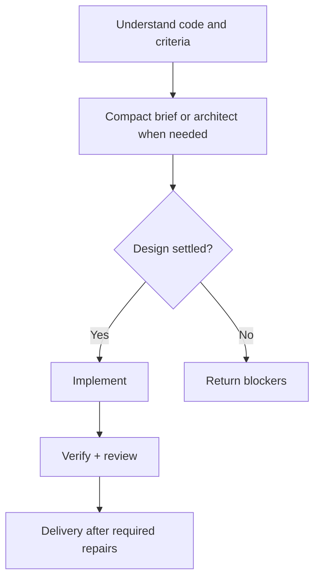

### Bugfixes

The [bugfix playbook](bigbrain/playbooks/bugfix.md) requires a faithful repro before fixing anything. It checks competing hypotheses against evidence; a fix crossing a function or module boundary uses architect first. If two fixes based on the same hypothesis fail, it reopens the cause investigation.

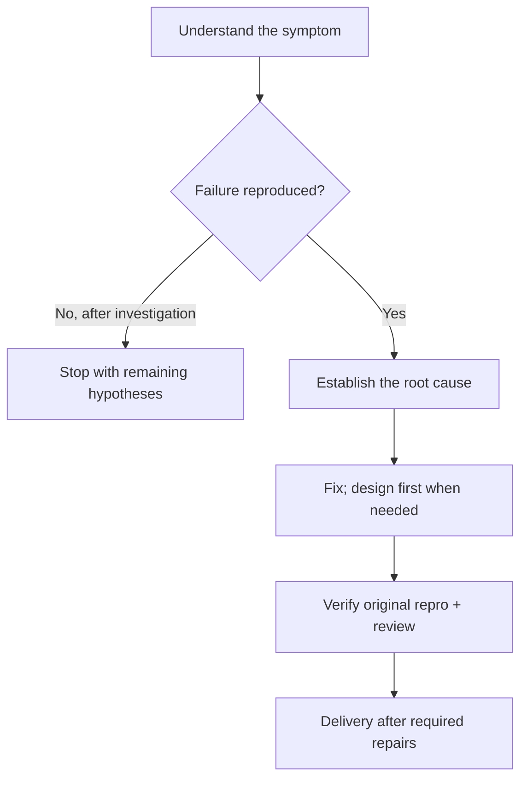

### Maintenance: refactors and chores

The [maintenance playbook](bigbrain/playbooks/maintenance.md) records a baseline and the contracts to preserve. Refactors preserve behavior; chores verify the requested operational result and preserve unrelated contracts. A required change outside that scope returns to the user.

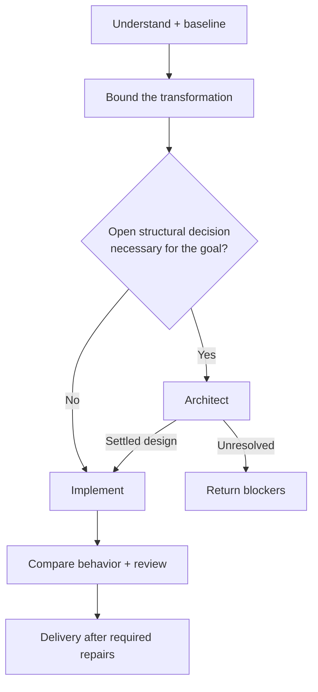

Responsibilities, state ownership, and dependencies can trigger architecture. Size or crossing module boundaries alone cannot. The design arena runs only for consequential alternatives that grounded facts, conventions, and the request cannot settle; candidates and the final synthesis must satisfy the same constraints. Plans and repairs retain these rules.

### Planning

The [plan playbook](bigbrain/playbooks/plan.md) produces independently verifiable slices, their prerequisites, and obligatory repo/CI checks. It preserves feature or maintenance mode and reuses existing grounding. A reviewer challenges the plan before it is saved; unresolved blockers remain explicit.

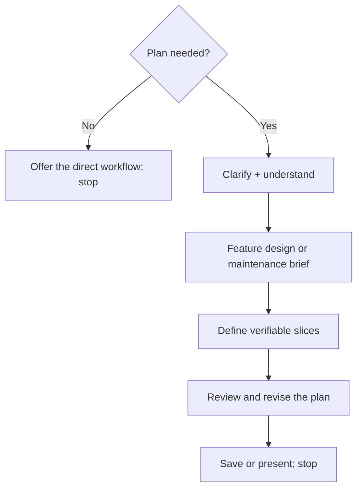

Planning stops at the plan. A small change with an obvious, low-risk approach needs no plan; a consequential unknown can justify even a one-slice plan.

### Saved plan slices

[Executing a slice](bigbrain/playbooks/plan.md#execute-a-saved-slice) first checks the current code, prerequisites, and assumptions. Earlier slices must work in the current checkout; a completion label is insufficient. Refresh only affected parts of a stale plan and challenge the revision before proceeding.

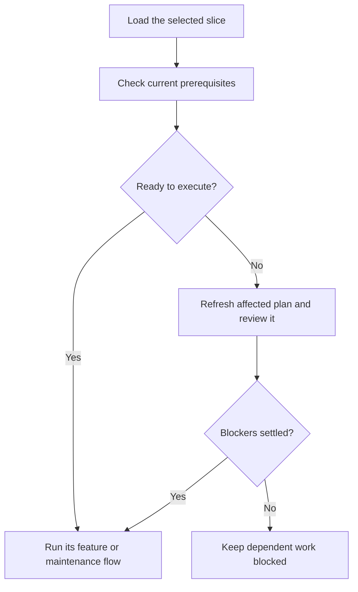

### Code explanations

The [how brick](bigbrain/bricks/how.md) answers how code works or where something belongs. The lead may settle a narrow question with targeted reads; substantial reading uses an explorer, and a wider subsystem uses independent exploration angles. Findings remain sourced.

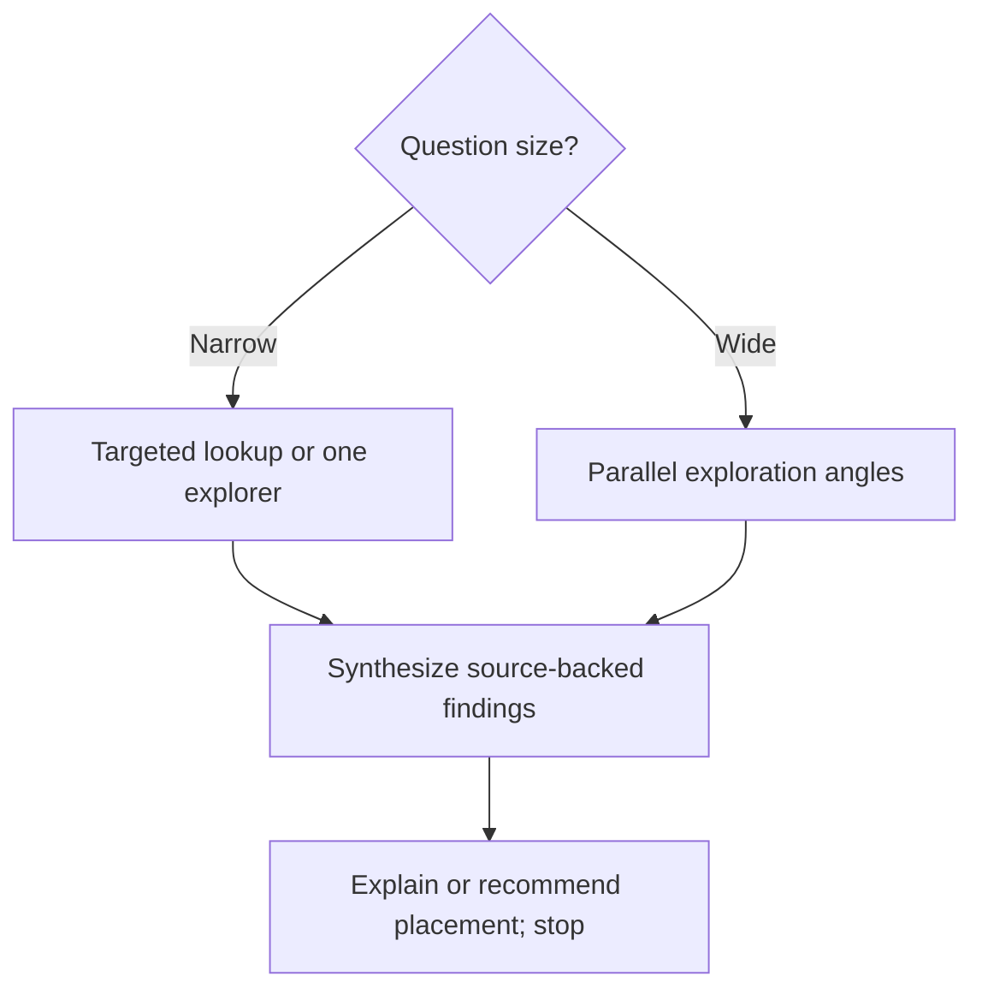

### Why investigations

The [why brick](bigbrain/bricks/why.md) separates historical rationale from present necessity. Missing rationale remains unknown and never authorizes removal. An explicit why request ends at the answer; inside a change workflow, the findings return as sourced constraints and gaps.

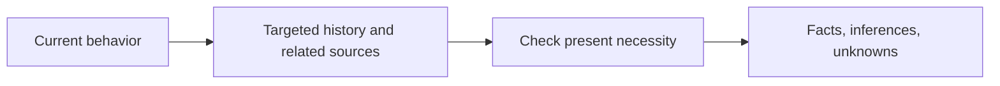

### Code reviews

The [review brick](bigbrain/bricks/interrogate.md) anchors the PR, branch, or diff to its actual head/base and matching source. Reviewers examine distinct angles. The lead ranks findings by severity and evidence, checks factual claims, and records each disposition.

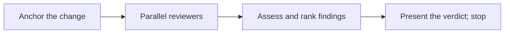

A direct review applies no changes unless requested. Inside a write workflow, its findings return to the caller's shared repair batch.

### Idea discussions

The [grill brick](bigbrain/bricks/grill.md) challenges the open decision frontier, looks up accessible facts, and asks the user for choices. A question or round limit never grants approval for an exclusively human choice.

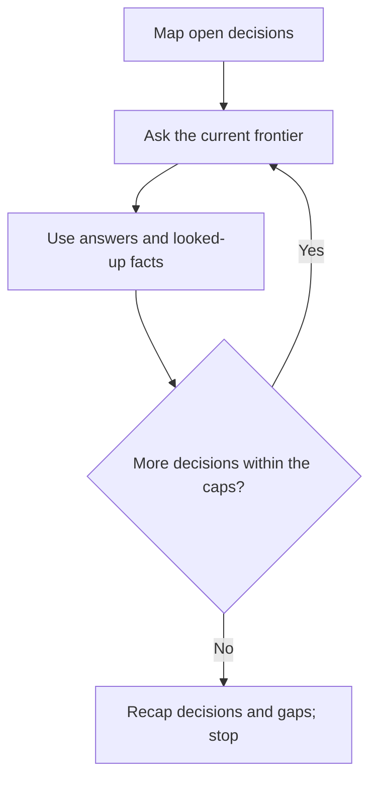

The direct route suggests a next step without starting it. When called by a playbook, the recap returns to that workflow; unresolved human choices keep dependent work paused. Authorized scope and reversible structural decisions need no recap confirmation or repeated go solely because an API or persisted shape changes.

### PR watch

The [watch brick](bigbrain/bricks/pr-watch.md) owns a bounded loop. The [shell helper](bigbrain/references/pr-watch-script.md) collects one read-only observation; the agent investigates it, verifies findings, and owns repairs, waits, pushes, and saved limits.

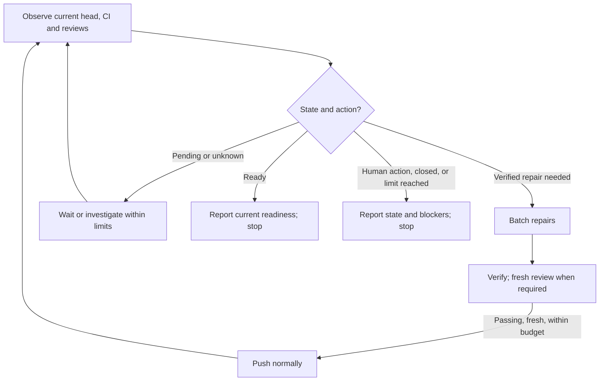

Failed or stale repairs are not pushed. A watch retains its deadline and counters on resume, reports meaningful changes, and never merges the PR. Draft status or missing approvals remains a human action; readiness is a current observation.

### Resume

[Resume](bigbrain/references/run-state.md#resume) restores the saved flow, criteria, counters, and evidence. Actual repo and PR state outrank the checkpoint; affected proofs must be refreshed after a relevant change.

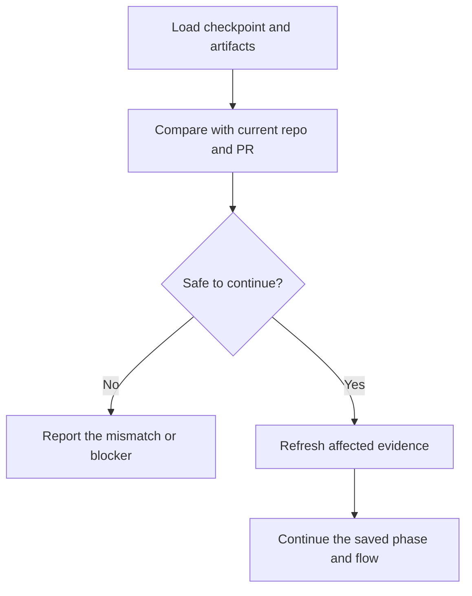

A saved watch resumes its watch phase, retaining its limits. It does not open another PR or restart a completed design. [Loop control](bigbrain/references/loop-control.md) also bounds structural returns after implementation and bug reproduction: `loop.max-replans` and `repro.max-rounds` default to three, with reproduction counting its first pass. Counters and attempt evidence survive resume and workflow transitions; a repeated blocker without new discriminating evidence stops the dependent loop before its numeric limit.

### Setup

The [setup playbook](bigbrain/playbooks/setup.md) configures supported model/effort choices and offers an optional PR size limit. Confirmed choices are stored in the skill configuration and the harness-native configuration when supported.

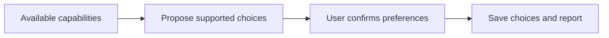

### Shared verification and repair

Feature, bugfix, and maintenance launch verification and review on the same fixed source/head/base. The lead waits for both reports before changing that snapshot, then sends counterexamples and accepted findings in one repair batch. Each batch costs one verification round, retained on resume.

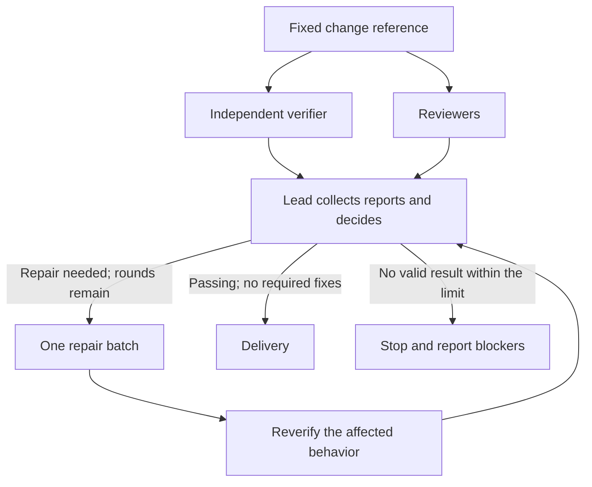

Verification runs obligatory repo/CI checks, tests, and a real run through the affected entry point when feasible. A unique isolated worktree can prove the result against the base without changing the user's checkout. Criteria and checks are classified before implementation: requested outcomes, ticket items, preserved contracts, and obligatory checks are required; extras may be supplementary. Missing classifications mean required. Required failed, inconclusive, absent, or stale proof blocks completion and delivery; supplementary gaps stay explicit. Configuring draft PRs does not waive the [delivery gate](bigbrain/bricks/verify.md#delivery-gate). An unfinished draft needs explicit authorization for that partial delivery, within repo/runtime rules, and remains incomplete. Repairs need fresh review when scope or design changes materially.

### Delivery and stacked branches

[Ship](bigbrain/bricks/ship.md) uses the same effective base/head/source for the diff, PR budget, proofs, review, and PR target. A new child branch starts from its resolved parent, and only the child's changes count against that parent.

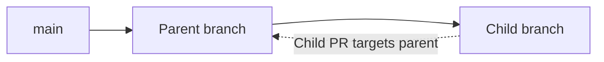

Before delivery, refresh the remote head and base. A late merge, rebase, or target change requires affected proofs and static checks again, plus review for material changes. The designated implementer owns branch/commit mutations; the lead pushes the returned commits and creates or updates the PR with an explicit target. Never rewrite pushed history or force-push.

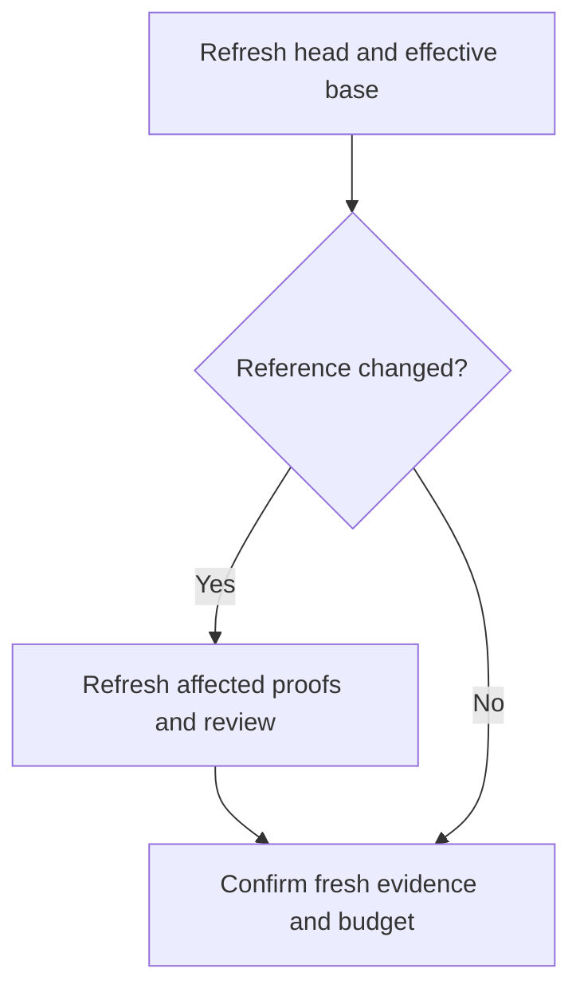

Once the evidence and budget permit delivery, the configured finish determines the outcome:

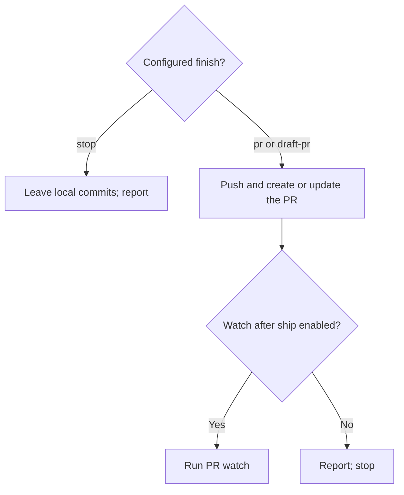

An unresolved reference, required proof without a current PASS, or exceeded budget blocks normal delivery. The explicitly authorized unfinished-draft exception remains incomplete and skips post-ship watch. `finish=stop` never starts a watch. A merged stack parent is handled according to publication state and repo policy before evidence is refreshed. The skill never merges PRs.

## Preferences

Change lasting preferences in plain language:

```text
/bigbrain from now on, open PRs as drafts here
```

Settings live in `~/.agents/config/bigbrain.md`, with global defaults and optional overrides per repository. Project knowledge and resumable checkpoints are stored separately, outside your checkout.

For the exact settings and defaults, see [configuration](bigbrain/references/config.md).

## Develop locally

Clone the repository and link the skill so edits apply immediately:

```bash
git clone git@github.com:LeoMartinDev/skills.git
cd skills
mkdir -p ~/.agents/skills ~/.claude/skills
ln -s "$PWD/bigbrain" ~/.agents/skills/bigbrain
ln -s ~/.agents/skills/bigbrain ~/.claude/skills/bigbrain
```

The skill is organized into small files loaded as needed:

- [SKILL.md](bigbrain/SKILL.md): entry point, routing, and lead rules.
- [Playbooks](bigbrain/playbooks/): feature, bugfix, maintenance, plan, and setup workflows.
- [Bricks](bigbrain/bricks/): reusable steps such as exploration, implementation, review, and shipping.
- [Principles](bigbrain/principles/): engineering rules applied when relevant.
- [References](bigbrain/references/): settings, memory, checkpoints, and agent adapters.

Keep each skill file under 80 lines and check referenced paths when editing. To validate behavior, run a clear feature request and a vague request in a sandbox repository: the first should proceed, and the second should ask for the missing decisions.

## Inspired by pstack

bigbrain owes a lot to [pstack](https://github.com/cursor/plugins/tree/main/pstack) by poteto (Lauren Tan): keeping the lead's context small, grounding decisions in code, designing before implementing, challenging changes with multiple models, and proving results on the real artifact. The `how`, `architect`, `arena`, and `interrogate` bricks adapt those ideas, alongside many of its engineering principles.

bigbrain reshapes that foundation into a smaller personal workflow:

| Area | pstack | bigbrain |
|---|---|---|
| Packaging | A Cursor plugin with separately invokable skills and subagents. | One `/bigbrain` skill, with internal bricks and principles loaded as needed. |
| Coding agents | Built around Cursor's tools, rules, and runtime. | Adapters for Claude Code, Cursor, Delta, omp, opencode, Pi, and Zed, plus a generic fallback. |
| Scope | Broader playbooks, including performance, runtime forensics, prototypes, and multi-day orchestration. | Focused on features, bugs, maintenance, plans, explanations, reviews, idea discussions, and bounded PR watches. |
| Rationale | A dedicated why investigation across engineering context. | A bounded `why` brick, explicitly routed or used for consequential grounding/design questions, with historical rationale and present necessity assessed separately. |
| Arena | Parallel candidates can produce different kinds of artifacts. | Candidates propose designs before implementation; one implementer builds the settled design. |
| Review | Each configured reviewer gets the same prompt and rubric. | Two reviewers take assigned angles, alongside a fresh verifier on the same commit; repairs are batched and reverified. |
| Delivery | Includes workflows for landing verified PR stacks and autonomous merges. | Opens a PR by default and never merges; large changes become smaller planned PRs. |

Both share the same emphasis on engineering judgment, small changes, independent scrutiny, and verification. bigbrain is a personal adaptation of that approach, with its own routing and execution rules. It can be installed on its own without pstack.
