# bigbrain

**Give your coding agent a task. It coordinates the work and checks the result.**

bigbrain is a personal engineering skill for building features, fixing bugs, refactoring code, handling chores, planning changes, and reviewing code. The main agent acts as the lead: it makes decisions and delegates exploration, implementation, verification, and review to subagents.

**Heavily inspired by [pstack](https://github.com/cursor/plugins/tree/main/pstack) by poteto (Lauren Tan).** Its engineering principles, delegation approach, and workflows are the foundation of bigbrain. See [what differs](#inspired-by-pstack) below.

```text
/bigbrain add a CSV export to the invoices list
```

For features, fixes, refactors, and chores, the default outcome is an open pull request with the decisions and verification evidence. If the request is clear, the agent works through it autonomously. If a product or scope decision needs your input, it asks.

## Install

```bash
npx skills add LeoMartinDev/skills -g
```

To update to the latest version:

```bash
npx skills update bigbrain -g
```

Then run this once in each coding agent to choose models for the different roles:

```text
/bigbrain setup
```

Setup is optional. You can defer it or keep the agent's model choices.

Supported agents: Claude Code, Cursor, Delta, omp, opencode, Pi, and Zed. Other agents use a generic fallback and report unavailable capabilities. In omp, use `/skill:bigbrain` instead of `/bigbrain`.

## Use it

Write a request after `/bigbrain`. You can also pass a GitHub issue URL, a Notion page, or a saved plan.

| What you want | Example |
|---|---|
| [Build a feature](#features) | `/bigbrain add a CSV export to the invoices list` |
| [Fix a bug](#bugfixes) | `/bigbrain the dashboard total is off by one cent` |
| [Refactor or simplify code](#maintenance-refactors-and-chores) | `/bigbrain simplify invoice calculation while preserving its behavior` |
| [Handle a chore](#maintenance-refactors-and-chores) | `/bigbrain update the lint configuration to the repo's new rules` |
| [Plan a larger change](#planning) | `/bigbrain plan the migration to the new numbering` |
| [Implement part of a plan](#saved-plan-slices) | `/bigbrain implement slice 2 of plans/numbering.md` |
| [Understand code](#code-explanations) | `/bigbrain how does invoice numbering work?` |
| [Investigate rationale](#why-investigations) | `/bigbrain why does invoice numbering retry at most three times?` |
| [Review changes](#code-reviews) | `/bigbrain review this branch` |
| [Challenge an idea](#idea-discussions) | `/bigbrain grill my idea: cache VAT rates per org` |
| [Watch a pull request](#pr-watch) | `/bigbrain watch-pr 123` |
| [Continue earlier work](#resume) | `/bigbrain resume feat/csv-export` |

Plans, explanations, reviews, and idea discussions stop at their result. A PR watch checks CI and reviews, repairs verified findings, and stops when ready or when its limits are reached. The skill never merges pull requests.

## How it works

The lead follows the selected playbook and keeps only decisions and short summaries in its context. Subagents handle exploration, implementation, verification, and review.

Before changing code, the agent checks the working tree and clarifies open goals or scope. Decisions only you can make pause the work that depends on them; everything else proceeds. There are no retry counters: an attempt is retried only when something new has appeared since the last one, otherwise the agent stops and reports what it tried.

### Features

The [feature playbook](bigbrain/playbooks/feature.md) sets observable criteria, then implements. When existing code already settles the shape, the lead writes a short brief; an open structural decision goes through a design step first, sometimes with competing designs from several models. Large changes move to [planning](#planning).

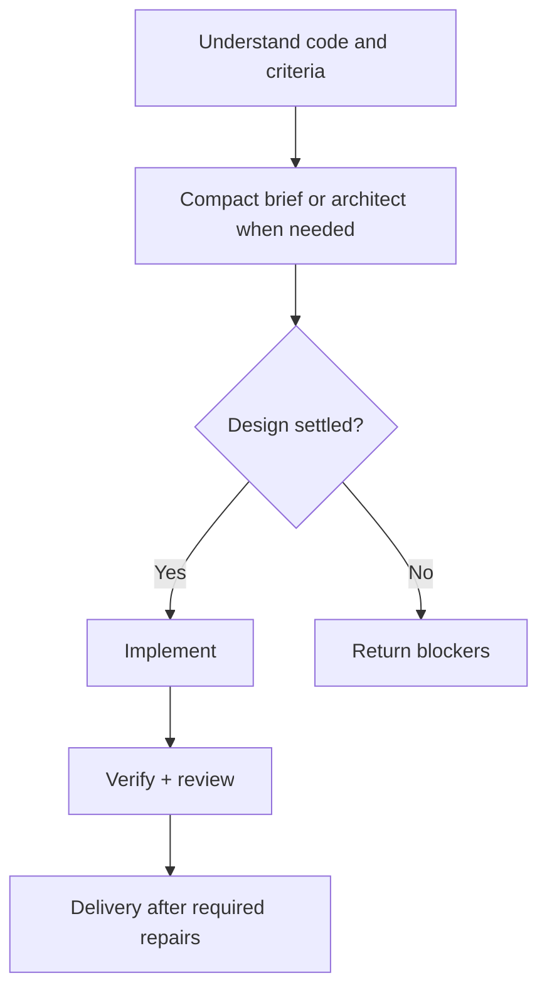

### Bugfixes

The [bugfix playbook](bigbrain/playbooks/bugfix.md) requires a faithful repro before fixing anything, then tests competing hypotheses in parallel until one cause is confirmed. Two failed fixes on the same hypothesis reopen the investigation.

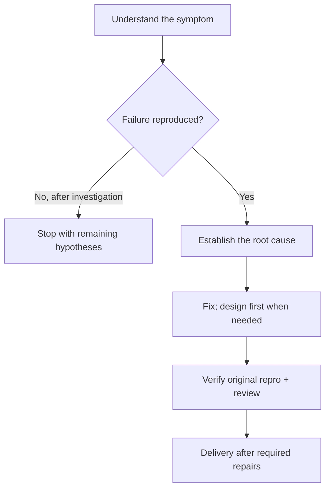

### Maintenance: refactors and chores

The [maintenance playbook](bigbrain/playbooks/maintenance.md) records a baseline and the contracts to preserve. Refactors preserve behavior; chores deliver the requested operational result. A change outside that scope comes back to you.

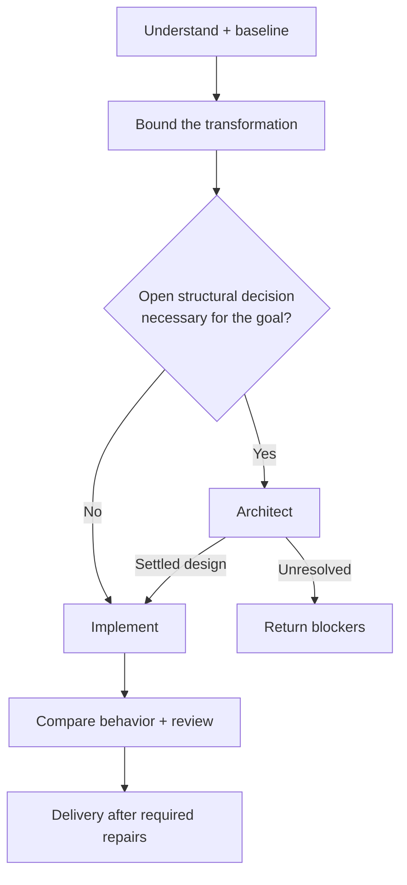

### Planning

The [plan playbook](bigbrain/playbooks/plan.md) produces independently verifiable slices, each one PR, with prerequisites and checks. A reviewer challenges the plan before it is saved.

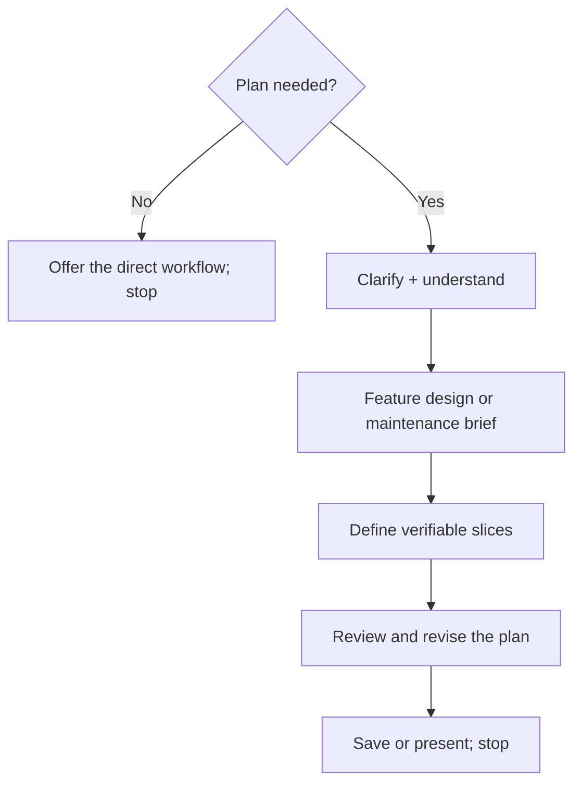

Planning stops at the plan. A small change with an obvious, low-risk approach needs no plan; a consequential unknown can justify even a one-slice plan.

### Saved plan slices

[Executing a slice](bigbrain/playbooks/plan.md#execute-a-saved-slice) first checks that its prerequisites hold in the current code. A stale plan is refreshed where it drifted before proceeding.

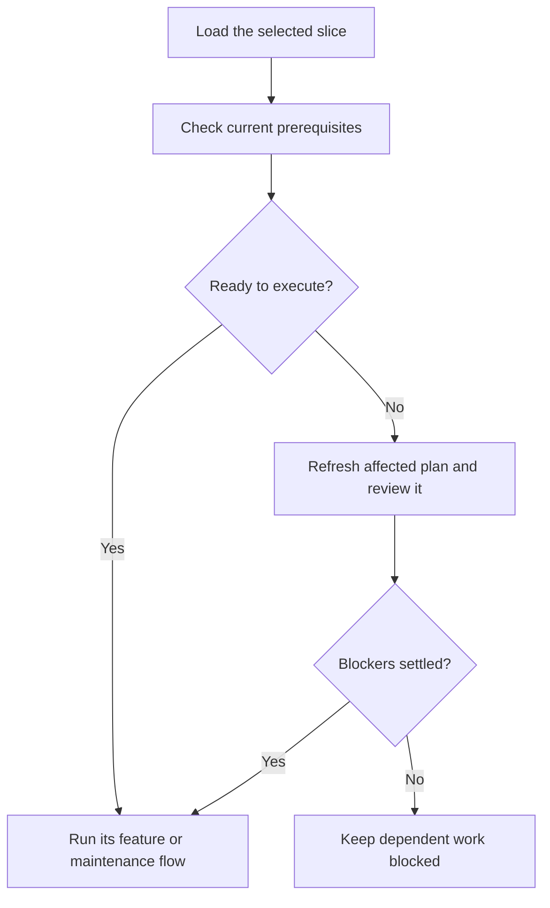

### Code explanations

The [how brick](bigbrain/bricks/how.md) answers how code works or where something belongs, with `path:line` sources. A wide question is split into parallel exploration angles.

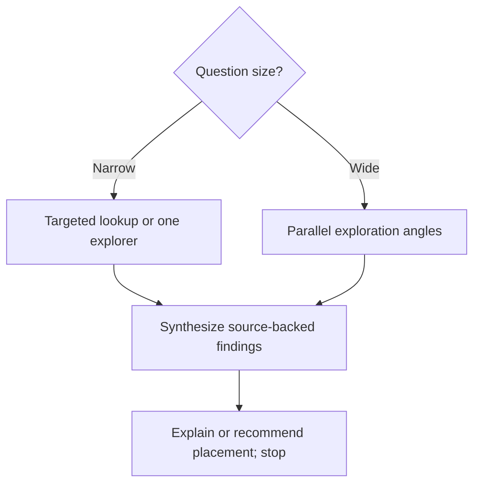

### Why investigations

The [why brick](bigbrain/bricks/why.md) separates the historical reason from whether it still applies, starting from code, Git history, and PRs. Claims carry sources and confidence; missing rationale stays unknown and never justifies a removal. It also runs inside a change when an unexplained workaround or limit affects the design.

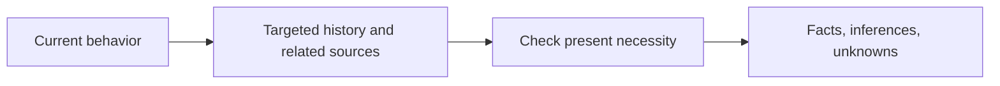

### Code reviews

The [review brick](bigbrain/bricks/interrogate.md) reviews the exact PR, branch, or diff from distinct angles. The lead checks each finding against the code and ranks them by severity.

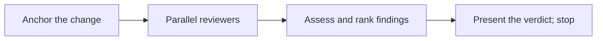

A direct review applies no changes unless requested. Inside a write workflow, its findings return to the caller's shared repair batch.

### Idea discussions

The [grill brick](bigbrain/bricks/grill.md) asks you the open decisions in rounds, looking up facts itself rather than asking you.

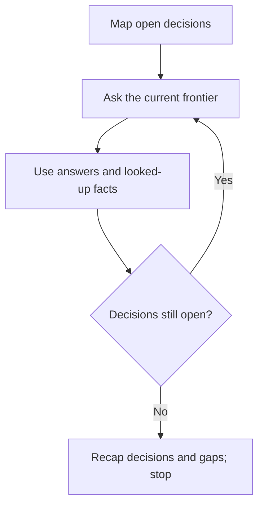

Called directly, it ends with a recap and a suggested next step. Inside a workflow, the recap feeds back into that workflow.

### PR watch

The [watch brick](bigbrain/bricks/pr-watch.md) runs a bounded loop. A [shell helper](bigbrain/references/pr-watch-script.md) takes one read-only snapshot of the PR; the agent verifies findings, repairs, and pushes.

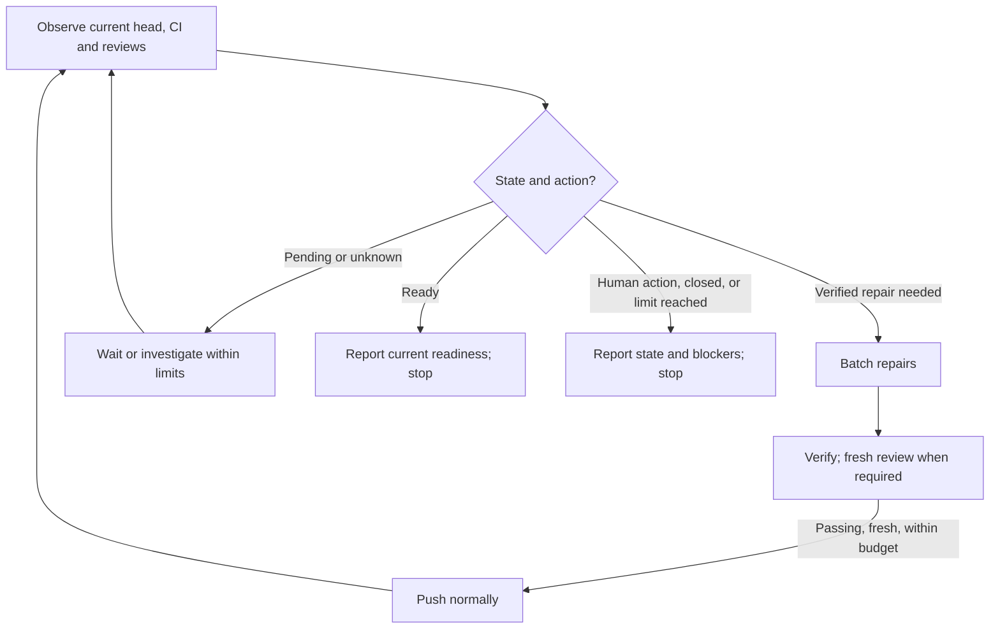

Only verified repairs are pushed. A watch stops at its deadline (`watch.timeout-minutes`) or when repairs stop making progress, and never merges; draft status and missing approvals are left to you.

### Resume

[Resume](bigbrain/playbooks/resume.md) picks up earlier work from its branch or PR, like pstack's session pickup. There is no saved state file: git, the PR, and the previous conversation when available are the trail. The agent reuses what is done and verified instead of redoing it.

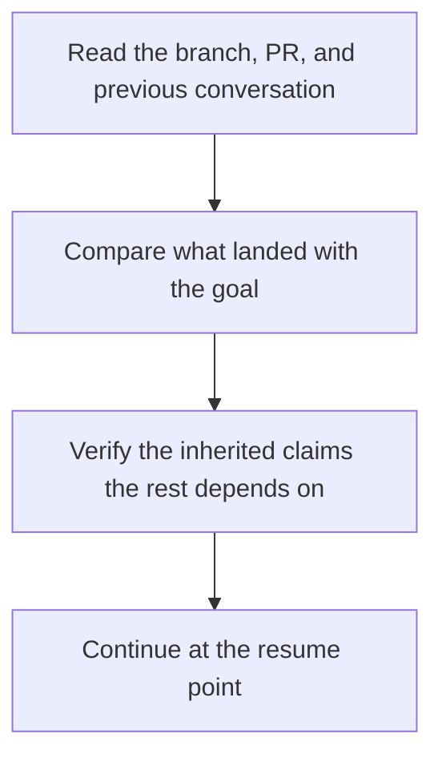

### Setup

The [setup playbook](bigbrain/playbooks/setup.md) configures supported model/effort choices and offers an optional PR size limit. Confirmed choices are stored in the skill configuration and the harness-native configuration when supported.

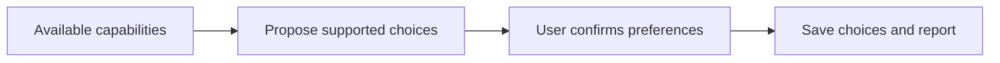

### Shared verification and repair

Feature, bugfix, and maintenance run an independent verifier and reviewers on the same commit, then send all fixes in one repair batch.

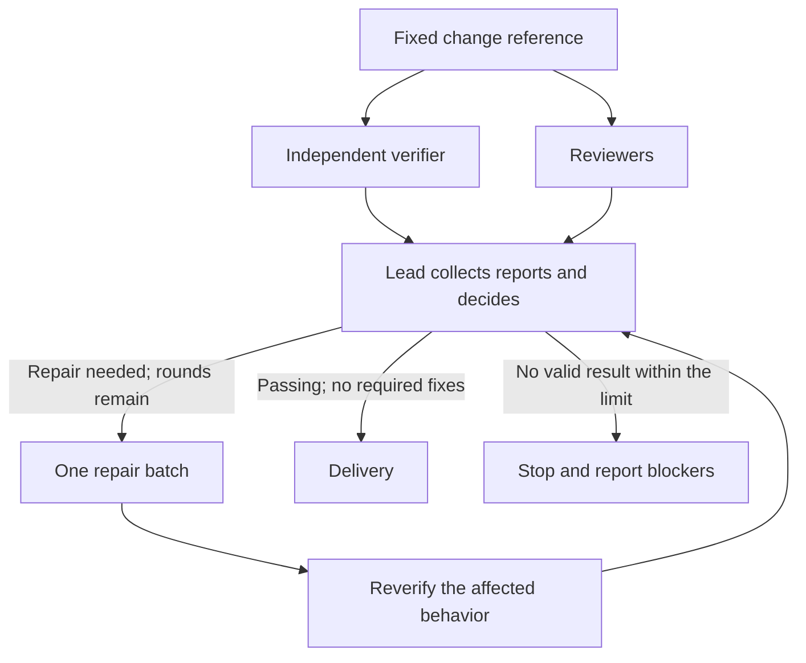

Verification runs the repo's CI checks, the tests, and a real run through the affected entry point when feasible. The [delivery gate](bigbrain/bricks/verify.md#delivery-gate) defines done: every required criterion (ticket items, requested outcome, preserved contracts, CI checks) needs passing evidence on the current commit, or nothing ships.

### Delivery and stacked branches

[Ship](bigbrain/bricks/ship.md) measures, verifies, and targets the PR against the same base. A child branch in a stack targets its parent, and only its own changes count.

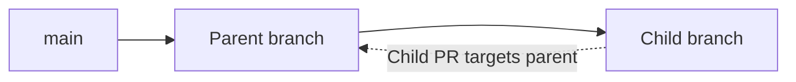

Before delivery, the agent refreshes the remote head and base and reruns the proofs a late change affects. It never rewrites pushed history or force-pushes.

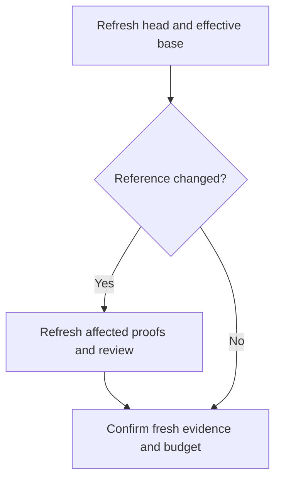

Once the evidence and budget permit delivery, the configured finish determines the outcome:

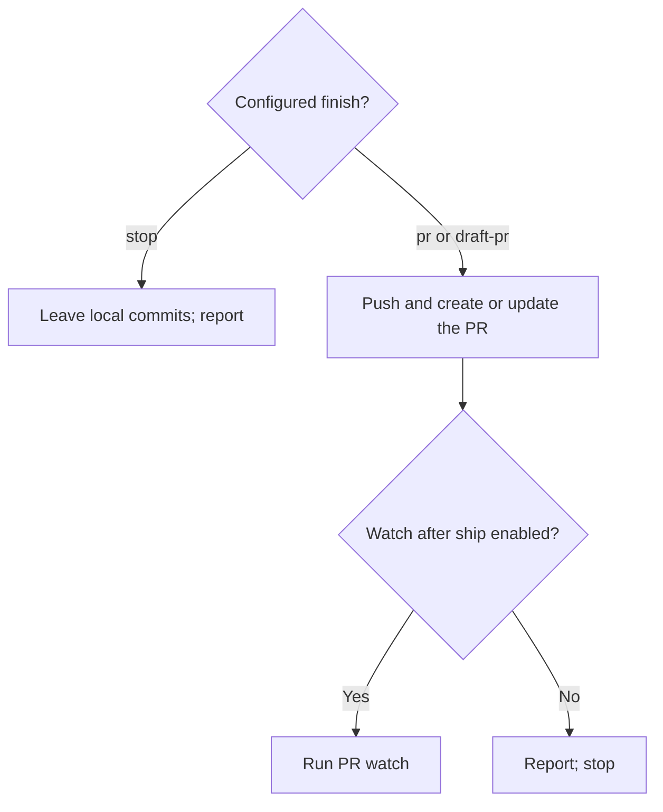

## Preferences

Change lasting preferences in plain language:

```text
/bigbrain from now on, open PRs as drafts here
```

Settings live in `~/.agents/config/bigbrain.md`, with global defaults and optional overrides per repository. Project knowledge is stored separately, outside your checkout.

For the exact settings and defaults, see [configuration](bigbrain/references/config.md).

## Develop locally

Clone the repository and link the skill so edits apply immediately:

```bash
git clone git@github.com:LeoMartinDev/skills.git
cd skills
mkdir -p ~/.agents/skills ~/.claude/skills
ln -s "$PWD/bigbrain" ~/.agents/skills/bigbrain
ln -s ~/.agents/skills/bigbrain ~/.claude/skills/bigbrain
```

The skill is organized into small files loaded as needed:

- [SKILL.md](bigbrain/SKILL.md): entry point, routing, and lead rules.
- [Playbooks](bigbrain/playbooks/): feature, bugfix, maintenance, plan, resume, and setup workflows.
- [Bricks](bigbrain/bricks/): reusable steps such as exploration, implementation, review, and shipping.
- [Principles](bigbrain/principles/): engineering rules applied when relevant.
- [References](bigbrain/references/): settings, memory, and agent adapters.
- [Scripts](bigbrain/scripts/): the read-only PR watch helper and its offline tests.

Keep each skill file within 1,000 words, and add a rule only for an observed failure it prevents. After editing, run `bash scripts/check-skill.sh` (word budget and referenced paths) and `bash bigbrain/scripts/tests/run.sh` (PR watch helper). To validate behavior, run a clear feature request and a vague request in a sandbox repository: the first should proceed, and the second should ask for the missing decisions.

## Inspired by pstack

bigbrain owes a lot to [pstack](https://github.com/cursor/plugins/tree/main/pstack) by poteto (Lauren Tan): keeping the lead's context small, grounding decisions in code, designing before implementing, challenging changes with multiple models, and proving results on the real artifact. The `how`, `architect`, `arena`, and `interrogate` bricks adapt those ideas, alongside many of its engineering principles.

bigbrain reshapes that foundation into a smaller personal workflow:

| Area | pstack | bigbrain |
|---|---|---|
| Packaging | A Cursor plugin with separately invokable skills and subagents. | One `/bigbrain` skill, with internal bricks and principles loaded as needed. |
| Coding agents | Built around Cursor's tools, rules, and runtime. | Adapters for Claude Code, Cursor, Delta, omp, opencode, Pi, and Zed, plus a generic fallback. |
| Scope | Broader playbooks, including performance, runtime forensics, prototypes, and multi-day orchestration. | Focused on features, bugs, maintenance, plans, explanations, reviews, idea discussions, and bounded PR watches. |
| Rationale | A dedicated why investigation across engineering context. | A bounded `why` brick, explicitly routed or used for consequential grounding/design questions, with historical rationale and present necessity assessed separately. |
| Arena | Parallel candidates can produce different kinds of artifacts. | Candidates propose designs before implementation; one implementer builds the settled design. |
| Review | Each configured reviewer gets the same prompt and rubric. | Two reviewers take assigned angles, alongside a fresh verifier on the same commit; repairs are batched and reverified. |
| Delivery | Includes workflows for landing verified PR stacks and autonomous merges. | Opens a PR by default and never merges; large changes become smaller planned PRs. |

Both share the same emphasis on engineering judgment, small changes, independent scrutiny, and verification. bigbrain is a personal adaptation of that approach, with its own routing and execution rules. It can be installed on its own without pstack.
